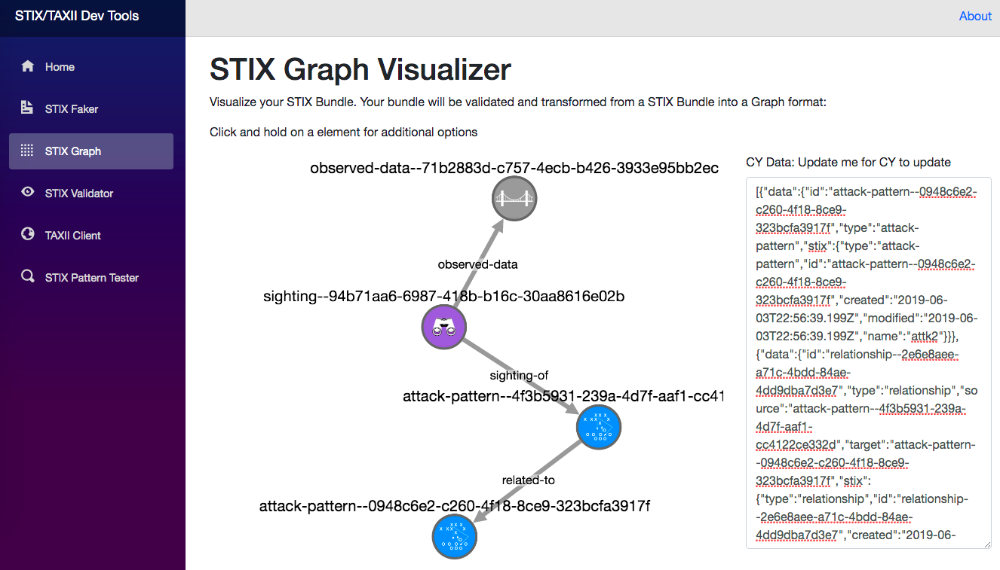

# STIX 2.x Java library

[](https://travis-ci.org/StephenOTT/STIX-Java)

The library aims to provide a flexible full implementation of [STIX 2.x](https://oasis-open.github.io/cti-documentation/resources#stix-20-specification).  
This means that a default implementation is provided that meets the STIX JSON specification and the core objects 
and properties are provided in such a way as you can easily override and extend any implementation detail to meet your 
variation of the specification.

De/Serilization is provided with Jackson.

Current Spec Target: **2.0**


## Other Implementations

### TAXII-springboot-bpmn

Taxii server based on springboot and backed by bpmn automation.
This taxii server implements the this STIX-Java library. 

https://github.com/StephenOTT/TAXII-springboot-bpmn
 
### stix2 (Gson based implementation)

If you are looking for a gson based implementation, [CS-AWARE](https://cs-aware.eu) provides a [gson based implementation of the Stix2 library](https://github.com/cs-aware/stix2).


## Sub-Second Precision Support

STIX-Java supports zero to 9 digit nanosecond precision with any date that is parsed by STIX-Java.  
This means that while a date that was sourced/generated by the STIX-Java library will be at sub-second precision of 3 digits, 
if you are parsing JSON with greater precision, or you supply a custom Instant with greater precision for a specific field, 
STIX-Java will support this and store the extra precision.

General rules to understand:

1. By default, timestamps generated natively by the STIX-Java library will be be with 3 digits of sub-second precision (millisecond precision).
1. Sub-second precision from 0 to 9 digits (9 digits its nano second precision: `hh:mm:ss.999999999`) is supported.  This means you can omit sub-seconds if you choose.
1. The StixInstant.class supports a `toString()` method that will generate a STIX Spec Date with the original precision preserved
1. Json parsing of JSON strings will support all of the above rules. 


-----

## Java Usage

Example unit test showing usage.

```groovy
import io.digitalstate.stix.bundle.Bundle
import io.digitalstate.stix.bundle.BundleObject
import io.digitalstate.stix.bundle.BundleableObject
import io.digitalstate.stix.common.StixParsers
import io.digitalstate.stix.sdo.objects.AttackPattern
import io.digitalstate.stix.sdo.objects.Malware
import io.digitalstate.stix.sro.objects.Relationship
import spock.lang.Specification

import java.time.Instant

class BundleSpec extends Specification {

    def "Basic 'uses' Relationship object and addition to bundle"(){
        when: "Create a Relationship with Attack Pattern and Malware"

        Relationship usesRel = Relationship.builder()
                .relationshipType("uses")
                .created(Instant.now())
                .sourceRef(AttackPattern.builder()
                        .name("Some Attack Pattern 1")
                        .build())
                .targetRef(Malware.builder()
                        .name("dog")
                        .addLabels("worm")
                        .build())
                .build()

        then: "print the JSON string version of the created relationship object"
        println usesRel.toJsonString()

        then: "parse the string back into a relationship object"
        BundleableObject parsedRelationship = StixParsers.parseObject(usesRel.toJsonString())
        assert parsedRelationship instanceof Relationship

        Relationship typedRelation = (Relationship)parsedRelationship

        and: "print the parsed relation"
        println typedRelation

        then: "ensure the original JSON matches the new JSON"
        assert usesRel.toJsonString() == typedRelation.toJsonString()

        then: "add the relationship into a bundle"
        Bundle bundle = Bundle.builder()
                .addObjects(usesRel)
                .build()

        and: "print the bundle json"
        println bundle.toJsonString()

        then: "parse json bundle back into object"
        BundleObject parsedBundle = StixParsers.parseBundle(bundle.toJsonString())
        assert parsedBundle instanceof Bundle
        Bundle typedBundle = (Bundle)parsedBundle

        then: "ensure original bundle and parsed bundles match in their json forms"
        assert bundle.toJsonString() == typedBundle.toJsonString()

    }

    def "bundleable object parsing"(){
        when: "setup parser and object"
        String attackPatternString = AttackPattern.builder()
                                        .name("Some Attack Pattern 1")
                                        .build().toJsonString()

        then: "can parse the json back into a attack Pattern"
        BundleableObject parsedAttackPatternBo = StixParsers.parseObject(attackPatternString)
        assert parsedAttackPatternBo instanceof AttackPattern

        AttackPattern parsedAttackPattern = (AttackPattern)StixParsers.parseObject(attackPatternString)
        println parsedAttackPattern.toJsonString()
    }
}
```


## JSON

1. All objects (Bundles, SDO, SRO, and Marking Definitions; anything that is a "bundleable object" + bundle) are able 
to be individually converted into their json equivalent.

1. All objects (Bundles, SDO, SRO, and Marking Definitions; anything that is a "bundleable object" + bundle) can be 
individually parsed from Json into a object.

1. Object references within out objects (for example a "object_markings" property), will create "dehydrated" objects 
when parsing from json into objects.  This means that the object will detect the "type" based on the Id value, 
extract the type, and create a object of the specified type with the "hydrated" attribute marked as false.


## STIX Marking Definitions and Granular Markings Data Redaction

This library implements a redaction feature to support JSON redaction during serialization. 
This feature allows the execution of Marking Definitions (`object_marking_refs`) and Granular Markings (`granular_marking_refs`). 

Current execution rules:

1. Object Markings Refs are executed as a "Entire Object" rule.
1. Granular Markings are executed as "property value masks" and "property removal".
1. Properties that are "required" (Minimum properties needed to init the specific object) are Redacted using a mask.
1. Properties that are "optional" (Properties that are not required to init the specific object) are Redacted using property removal.
1. UNDER REVIEW: Nested objects cannot be redacted within the nested object.  They must be redacted at the parent object level using the property in the parent that holds the child object.  

Marking Definitions and Granular Markings are enforced through a "Subject" security pattern: A Subject is defined at the 
time of serialization of a Bundle or bundleable object.
A subject is characteristics about a subject that define the security rules.  In STIX's  most basic form a subject has a 
list of "Object Markings" (TLP and Statements).  This markings are used as the Subject's context to define what markings 
the subject "has" at the time of serialization.  

When serialization occurs a the Subject's context 
(a set of object markings) are passed into the serialization process.  For each item in `object_marking_refs` and 
`granular_marking_refs`, the Subject's context is used for evaluation.  If the subject does not have all of the required 
Object Markings, then redaction is actioned.  

`object_marking_refs` are executed first, and if the subject is denied, 
then granular markings will be ignored, and the entire object will be redacted (removed and returned as `{}`).  
In the case of a serialization of a Bundle, a redacted object would result in it be omitted from the 
Bundle's `objects` array. 

If the subject passes all `object_marking_refs` validation, then `granular_marking_refs` are validated.  
For each Granular Marking object, the Object Marking is validated, and if denied, the Granular Marking's Selectors 
are actioned for redaction.  Once all `granular_marking_refs` objects have been processed, then resulting object is returned.


Consider the following example:

```groovy
Tlp tlp = Tlp.builder().tlp("red").build()
MarkingDefinition markingDefinition = MarkingDefinition.builder()
        .definition(tlp)
        .definitionType("tlp")
        .build()

GranularMarking granularMarking = GranularMarking.builder()
        .markingRef(markingDefinition)
        .addSelectors("granular_markings", "created_by_ref")
        .addSelectors("created")
        .build()

AttackPattern attackPattern = AttackPattern.builder()
        .name("some Attack Pattern")
        .addGranularMarkings(granularMarking)
        .createdByRef(Identity.builder()
            .name("some Identity")
            .identityClass("individual")
            .build())
        .build()
```

The above serialized with a Subject context that only contains a TLP=White Object Marking would result in the following JSON:

```json
{
  "type": "bundle",
  "id": "bundle--3d6bdcdd-2137-4e97-a8a4-8020dd30bc8d",
  "spec_version": "2.0",
  "objects": [
    {
      "type": "attack-pattern",
      "id": "attack-pattern--0f4d3058-f4de-4743-ae4c-988645309d92",
      "created_by_ref": "identity--__REDACTED__",
      "created": "██REDACTED██",
      "modified": "2018-12-19T20:49:06.403Z",
      "revoked": false,
      "name": "some Attack Pattern"
    }
  ]
}
```

The internal implementation is configured as follows:

```java
class SomeClass {
//...
    @JsonProperty("created_by_ref") @JsonInclude(value = NON_EMPTY, content = NON_EMPTY)
    @JsonIdentityInfo(generator= ObjectIdGenerators.PropertyGenerator.class, property="id")
    @JsonIdentityReference(alwaysAsId=true)
    @JsonDeserialize(converter = DomainObjectOptionalConverter.class)
    @Redactable(useMask = true, redactionMask = "identity--__REDACTED__")
    Optional<IdentitySdo> getCreatedByRef();
    
    @NotNull
    @JsonProperty("created")
    @Value.Default
    @Redactable(useMask = true)
    default Instant getCreated(){
        return Instant.now();
    }
    
    @NotNull
    @JsonProperty("granular_markings") @JsonInclude(NON_EMPTY)
    @Redactable
    Set<GranularMarkingDm> getGranularMarkings();
//...
}
```

Notice the varying usage of the `@Redactable` annotation.

If `object_marking_refs` were used and a bundle was generated with the Attack Pattern, the resulting bundle would contain:
```json
{
  "type": "bundle",
  "id": "bundle--3d6bdcdd-2137-4e97-a8a4-8020dd30bc8d",
  "spec_version": "2.0",
  "objects": []
}
```

`objects` is empty because the Attack Pattern would have been redacted at the object level.


Future Improvements:

1. Customizable redactions passed in based on the toJsonString() method and the Subject's context
1. Config for Throwing errors when redactions cannot be processed
1. Config for Ignoring errors when redactions cannot be process 


# STIX Graph Support / Network Graph

This feature is currently a active work in progress, and is subject to change.

This library provides the ability to generate cytoscape.js compliant json that can be imported into a cytoscape instance, and visualized.



The above image shows a web-app that consumes a STIX Bundle, passes it to the STIX-Java libary through a HTTP-request, 
and the request returns the Cytoscape compliant json for Network graph rendering. 

## Example json output

This library will consume a STIX Bundle, and convert it into Cytoscape.js nodes/edges json, such as:

Output was generated from the [BundleGraphSpec](./src/test/groovy/stix/bundle/BundleGraphSpec.groovy)

```json
[
  {
    "data": {
      "id": "ref-89093428-585b-4754-8a6d-8cb0e6ca0a60",
      "type": "ref",
      "source": "observed-data--14ab5c4d-a696-483d-8792-f5686d61b2b4",
      "target": "7ac69a4d-a984-4c19-a54b-13e3dd1d80e8--60cddb5b-9ea2-4855-82b7-f54eca297214",
      "label": "ipv4-addr",
      "ref_type": "cyber_observable"
    }
  },
  {
    "data": {
      "id": "ref-8dca6278-645f-4737-9a56-f56c8cbb44a2",
      "type": "ref",
      "source": "observed-data--14ab5c4d-a696-483d-8792-f5686d61b2b4",
      "target": "95a14320-0d63-4d97-9173-1994c2ed7b77--a3456ae7-cddb-45de-b366-d5b56b0c3ee0",
      "label": "ipv4-addr",
      "ref_type": "cyber_observable"
    }
  },
  {
    "data": {
      "id": "ref-a076819b-1e6e-4d3d-822c-96f215444f23",
      "type": "ref",
      "source": "sighting--16103a5c-22e9-46ec-91bc-0ae521c60206",
      "target": "attack-pattern--4acfe66e-587f-42e4-8daa-4d9da233f7c9",
      "label": "sighting-of",
      "ref_type": "sighting_of_ref"
    }
  },
  {
    "data": {
      "id": "ref-2f53e5f1-9897-45cd-a1ca-12671419a021",
      "type": "ref",
      "source": "observed-data--14ab5c4d-a696-483d-8792-f5686d61b2b4",
      "target": "1366d1a7-ffef-4155-af4e-18cef6517502--c427ea06-8615-49ed-9701-d9e7c04c7aea",
      "label": "ipv4-addr",
      "ref_type": "cyber_observable"
    }
  },
  {
    "data": {
      "id": "c0bedd31-6d9f-48b7-afe5-762c13da69a3--8bbe16e2-8128-4cde-973f-15ac7d32aaa2",
      "type": "coo-domain-name",
      "stix": {
        "type": "domain-name",
        "value": "http://google.com"
      }
    }
  },
  {
    "data": {
      "id": "ref-3901a3de-a38a-4bea-b784-3a08caef4c5f",
      "type": "ref",
      "source": "observed-data--14ab5c4d-a696-483d-8792-f5686d61b2b4",
      "target": "f8647fdf-9011-4f7b-a240-462a20c1a29d--5f13f5fd-19f8-4e04-a53a-fd03dd54a1a2",
      "label": "ipv4-addr",
      "ref_type": "cyber_observable"
    }
  },
  {
    "data": {
      "id": "attack-pattern--cd482a80-3e47-4eed-9542-bbcf69da9405",
      "type": "attack-pattern",
      "stix": {
        "type": "attack-pattern",
        "id": "attack-pattern--cd482a80-3e47-4eed-9542-bbcf69da9405",
        "created": "2019-06-05T22:49:29.813Z",
        "modified": "2019-06-05T22:49:29.813Z",
        "name": "attk2"
      }
    }
  },
  {
    "data": {
      "id": "sighting--16103a5c-22e9-46ec-91bc-0ae521c60206",
      "type": "sighting",
      "stix": {
        "type": "sighting",
        "id": "sighting--16103a5c-22e9-46ec-91bc-0ae521c60206",
        "created": "2019-06-05T22:49:30.798Z",
        "modified": "2019-06-05T22:49:30.798Z",
        "first_seen": "2019-06-05T22:49:30.76Z",
        "last_seen": "2019-06-05T22:49:30.788Z",
        "count": 1,
        "sighting_of_ref": "attack-pattern--4acfe66e-587f-42e4-8daa-4d9da233f7c9",
        "observed_data_refs": [
          "observed-data--14ab5c4d-a696-483d-8792-f5686d61b2b4"
        ]
      }
    }
  },
  {
    "data": {
      "id": "1366d1a7-ffef-4155-af4e-18cef6517502--c427ea06-8615-49ed-9701-d9e7c04c7aea",
      "type": "coo-ipv4-addr",
      "stix": {
        "type": "ipv4-addr",
        "value": "10.10.10.14"
      }
    }
  },
  {
    "data": {
      "id": "ref-6b0818cf-9edf-4073-ade4-827df72de27a",
      "type": "ref",
      "source": "observed-data--14ab5c4d-a696-483d-8792-f5686d61b2b4",
      "target": "c31c8cbf-7bd3-4865-8e89-7bbe1962d9af--34337862-99fd-46e0-a8c3-3fc7a774114e",
      "label": "ipv4-addr",
      "ref_type": "cyber_observable"
    }
  },
  {
    "data": {
      "id": "f8647fdf-9011-4f7b-a240-462a20c1a29d--5f13f5fd-19f8-4e04-a53a-fd03dd54a1a2",
      "type": "coo-ipv4-addr",
      "stix": {
        "type": "ipv4-addr",
        "value": "10.10.10.15"
      }
    }
  },
  {
    "data": {
      "id": "attack-pattern--4acfe66e-587f-42e4-8daa-4d9da233f7c9",
      "type": "attack-pattern",
      "stix": {
        "id": "attack-pattern--4acfe66e-587f-42e4-8daa-4d9da233f7c9",
        "type": "attack-pattern",
        "created": "2019-06-05T22:49:28.455Z",
        "modified": "2019-06-05T22:49:28.455Z",
        "name": "attk1"
      }
    }
  },
  {
    "data": {
      "id": "relationship--70fca22d-4385-4194-a093-3a7cdb1a2a85",
      "type": "relationship",
      "source": "attack-pattern--4acfe66e-587f-42e4-8daa-4d9da233f7c9",
      "target": "attack-pattern--cd482a80-3e47-4eed-9542-bbcf69da9405",
      "stix": {
        "type": "relationship",
        "id": "relationship--70fca22d-4385-4194-a093-3a7cdb1a2a85",
        "created": "2019-06-05T22:49:29.897Z",
        "modified": "2019-06-05T22:49:29.897Z",
        "relationship_type": "related-to",
        "source_ref": "attack-pattern--4acfe66e-587f-42e4-8daa-4d9da233f7c9",
        "target_ref": "attack-pattern--cd482a80-3e47-4eed-9542-bbcf69da9405"
      },
      "label": "related-to",
      "relationship_type": "related-to"
    }
  },
  {
    "data": {
      "id": "95a14320-0d63-4d97-9173-1994c2ed7b77--a3456ae7-cddb-45de-b366-d5b56b0c3ee0",
      "type": "coo-ipv4-addr",
      "stix": {
        "type": "ipv4-addr",
        "value": "10.10.10.11"
      }
    }
  },
  {
    "data": {
      "id": "observed-data--14ab5c4d-a696-483d-8792-f5686d61b2b4",
      "type": "observed-data",
      "stix": {
        "id": "observed-data--14ab5c4d-a696-483d-8792-f5686d61b2b4",
        "type": "observed-data",
        "created": "2019-06-05T22:49:30.479Z",
        "modified": "2019-06-05T22:49:30.479Z",
        "first_observed": "2019-06-05T22:49:30.47Z",
        "last_observed": "2019-06-05T22:49:30.472Z",
        "number_observed": 2,
        "objects": {
          "c0bedd31-6d9f-48b7-afe5-762c13da69a3": {
            "type": "domain-name",
            "value": "http://google.com"
          },
          "7ac69a4d-a984-4c19-a54b-13e3dd1d80e8": {
            "type": "ipv4-addr",
            "value": "10.10.10.10"
          },
          "95a14320-0d63-4d97-9173-1994c2ed7b77": {
            "type": "ipv4-addr",
            "value": "10.10.10.11"
          },
          "c31c8cbf-7bd3-4865-8e89-7bbe1962d9af": {
            "type": "ipv4-addr",
            "value": "10.10.10.12"
          },
          "59d133cc-d29c-4056-aeeb-6791842c0b75": {
            "type": "ipv4-addr",
            "value": "10.10.10.13"
          },
          "1366d1a7-ffef-4155-af4e-18cef6517502": {
            "type": "ipv4-addr",
            "value": "10.10.10.14"
          },
          "f8647fdf-9011-4f7b-a240-462a20c1a29d": {
            "type": "ipv4-addr",
            "value": "10.10.10.15"
          }
        }
      }
    }
  },
  {
    "data": {
      "id": "59d133cc-d29c-4056-aeeb-6791842c0b75--c1efba8b-7ef4-4b12-a768-4b1d99d82eb7",
      "type": "coo-ipv4-addr",
      "stix": {
        "type": "ipv4-addr",
        "value": "10.10.10.13"
      }
    }
  },
  {
    "data": {
      "id": "ref-029c8857-f9e0-49c6-bdaf-d3391acfbd61",
      "type": "ref",
      "source": "observed-data--14ab5c4d-a696-483d-8792-f5686d61b2b4",
      "target": "59d133cc-d29c-4056-aeeb-6791842c0b75--c1efba8b-7ef4-4b12-a768-4b1d99d82eb7",
      "label": "ipv4-addr",
      "ref_type": "cyber_observable"
    }
  },
  {
    "data": {
      "id": "7ac69a4d-a984-4c19-a54b-13e3dd1d80e8--60cddb5b-9ea2-4855-82b7-f54eca297214",
      "type": "coo-ipv4-addr",
      "stix": {
        "type": "ipv4-addr",
        "value": "10.10.10.10"
      }
    }
  },
  {
    "data": {
      "id": "c31c8cbf-7bd3-4865-8e89-7bbe1962d9af--34337862-99fd-46e0-a8c3-3fc7a774114e",
      "type": "coo-ipv4-addr",
      "stix": {
        "type": "ipv4-addr",
        "value": "10.10.10.12"
      }
    }
  },
  {
    "data": {
      "id": "ref-a8cfe6f7-6d73-4e38-9199-0919fd6c3b74",
      "type": "ref",
      "source": "sighting--16103a5c-22e9-46ec-91bc-0ae521c60206",
      "target": "observed-data--14ab5c4d-a696-483d-8792-f5686d61b2b4",
      "label": "observed-data",
      "ref_type": "observed_data"
    }
  },
  {
    "data": {
      "id": "ref-0ef21e43-1451-4b0a-8f8e-866e01b91eb0",
      "type": "ref",
      "source": "observed-data--14ab5c4d-a696-483d-8792-f5686d61b2b4",
      "target": "c0bedd31-6d9f-48b7-afe5-762c13da69a3--8bbe16e2-8128-4cde-973f-15ac7d32aaa2",
      "label": "domain-name",
      "ref_type": "cyber_observable"
    }
  }
]
```


# Charon Data Flow


# Workflow / BPM / BPMN

## Example Process Usage


-----

# Raw notes

This project is a packaging of multiple components that will be split into individual projects at some point.

1. A full [CTI STIX](https://oasis-open.github.io/cti-documentation/) (Structured Threat Information Expression Language) Java8 implementation. (`io.digitalstate.stix`).  The goal is for flexibility and reuse by other Java projects.
1. Charon Application ("Charon Server"):
    1. A SpringBoot based instance of [Camunda BPM](https://docs.camunda.org/manual/7.9/)
    1. Possible: A [TAXII](https://oasis-open.github.io/cti-documentation/taxii/intro) server implemented in SpringBoot, tied to the Camunda BPM SpringBoot instance.
    1. A bridge of CTI STIX with Camunda BPM BPMN Java-Delegates and Scripting Usage.
    1. Possible: Mongo Spring Data Mapping from the STIX Java8 implementation to Mongo Documents.
    1. Possible: Additional REST APIs in addition to the TAXII API that provide missing functionality that is available from using Camunda.
    1. Monitoring of BPMN and STIX data usage with [Prometheus Camunda Plugin](https://github.com/StephenOTT/camunda-prometheus-process-engine-plugin) 
    

**Overall Concept:** Enable organizations working with CTI and STIX to have the "application" 
(Charon) easily adapt to the organizations internal or standardized security processes.  
An organization should not have to change their security models for a "vendor".

Further Notes:

By Using STIX as a common language for CTI, automated and manual workflows can be created for multi-system use:
Where each CTI system can generate STIX data and the downstream workflows can process the CTI for whatever purpose 
without the need to understand the upstream CTI system (whether it be new and shinny, old and legacy, or 
some customized CTI DB that has little understanding outside of the specific domain-usage).

Leverage CTI's Who, Why, Where, How, What data to process data into meaningful automation and iterate as needed with the Charon engine.
When you need manual intervention, with human eyes and hands, you can continue to leverage Charon to process those human tasks.

 - Process Information
 - Detection
 - Artifact storage and processing
 - Analyze
 - Respond
 
 
 Share CTI across the CTI network with the common exchange format, and enrich the data with STIX Data Enrichment from downstream enrichment processes.
 
 "Automation Engine" with OSS.
 
 Initiate Translation Services through the automation: When translation of CTI is required, it can be packaged as a 
 STIX bundle and processed into a workflow for processing: automatically or with human intervention.


Share Workflows (Shareable Workflows) across organizations and within the organization.  Allowing standardization regardless of the specific engine being used.

Monitor and Track real-time events from your upstream incident response system, and process those events in STIX for 
downstream CTI event processing by actors that may not have access or want access to the upstream incident response system.

Integration ML and AI at any point within the automation.  Do not tightly couple the ML and AI into the workflows: 
This allows easy swapping of ML and AI technologies, products, and innovations as a underlying capability / 
force multiplier without having to integration "a whole other system".

Enable third-party organizations to deploy the same engine within your network, collect data, 
and stream it upstream to central CTI processors.  Enable the third-parties to implement their specific CTI processing 
processes directly in the engine without the need to "conform to how the upstream system wants to do things".
Then when the upstream system receives the STIX CTI, it can be processed based on your knowledge of that third-party 
systems processes: to which you can have transparency into with reviewing their "processes" defined in the engine.

Implement organization HR conditions into the workflows: If someone does not response or review in X time, if someone is on holidays, etc

Push out IOCs and Attack patterns to downstream consumers: Consumers can establish business rules that outline their 
systems and networks, and as IOCs and APs are pushed, they can be evaluated automatically (and/or manually) 
by the downstream consumer system.
Same can be applied to Abnormal Behaviour reporting or Pattern awareness.

Data Interruption reporting: Reporting in standard formats for org, and having to consume into STIX.

Use the same engine to automate CTI testing and python scripts.  Engine can be wrapped up into a single JAR, including DB.
Can be used as a CLI tool as well.

Measure the impacts of CTI and the various STIX data being received.

Use the STIX stream as auditing trail capability: being able to collect STIX events and cross those 
events based on aggregation, counts over period of time, etc. Then generate a Request for review based on the conditions.

Very easy to tie in ML for Event data: Such as Kibana xPack reviewing the various types of 
data and detecting new patterns such as counts and increases in periods or locations.

Remove the problem of "Lack of Time to implement processes" (reported as 43% of the time).  
Champions can create common processes to be easily and quickly adopted by downstream groups.


Example Use Cases:
1. STIX Bureaucracy Management using Charon.
1. Security Approvals and Revocations for STIX data exposed through TAXII.
1. Managing TAXII "Hubs" / Central Databases and the review, adjustements, and approvals of submissions of data into the Charon / STIX DB.
1. Life-cycling STIX data through BPMN.
1. Managing TAXII / STIX data access requests, apply-and-removal of STIXX markings.
1. Multi-Department STIX Data Isolation with STIX data submission to UpStream STIX datasource.
1. Execute automated and manual workflows based on STIX data events (CRUD events in STIX data). 
1. Concept of "Shareable Workflows":
    1. Ability to share common business and technical workflows across a single organization and across many organiztions.
    1. Ability to create Executable Workflows based on data events within STIX data.
    